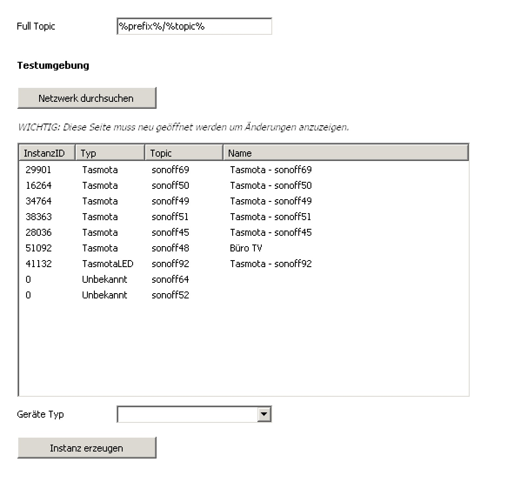

# IPS-TasmotaKonfigurator
Mit dem IPS-Tasmota Konfigurator können Tasmota Geräte im Netzwerk gefunden werden und direkt in IPS angelegt werden.

## Inhaltverzeichnis
1. [Konfiguration](#1-konfiguration)

## 1. Konfiguration

  

In den Konfigurator Instanzen den Tasmota Configurator suchen und hinzufügen.
Mit dem Button **Netzwerk durchsuchen** werden alle Tasmota Geräte im Netzwerk gesucht.
Um die Änderungen in der Form sehen zu können, muss das Konfigurationsformular ein Mal erneut aufgerufen werden.

Um eine Instanz zu erzeugen, muss das jeweilige Gerät in der Liste selektiert werden und der Geräte Typ ausgewählt werden, danach nur auf den Button **Instanz erzeugen** klicken.

Die Übergeordnete Instanz sollte immer der IPS_KS_MQTTClient sein, dieser sollte normalerweise direkt gesetzt werden, wenn das Modul angelegt wird.